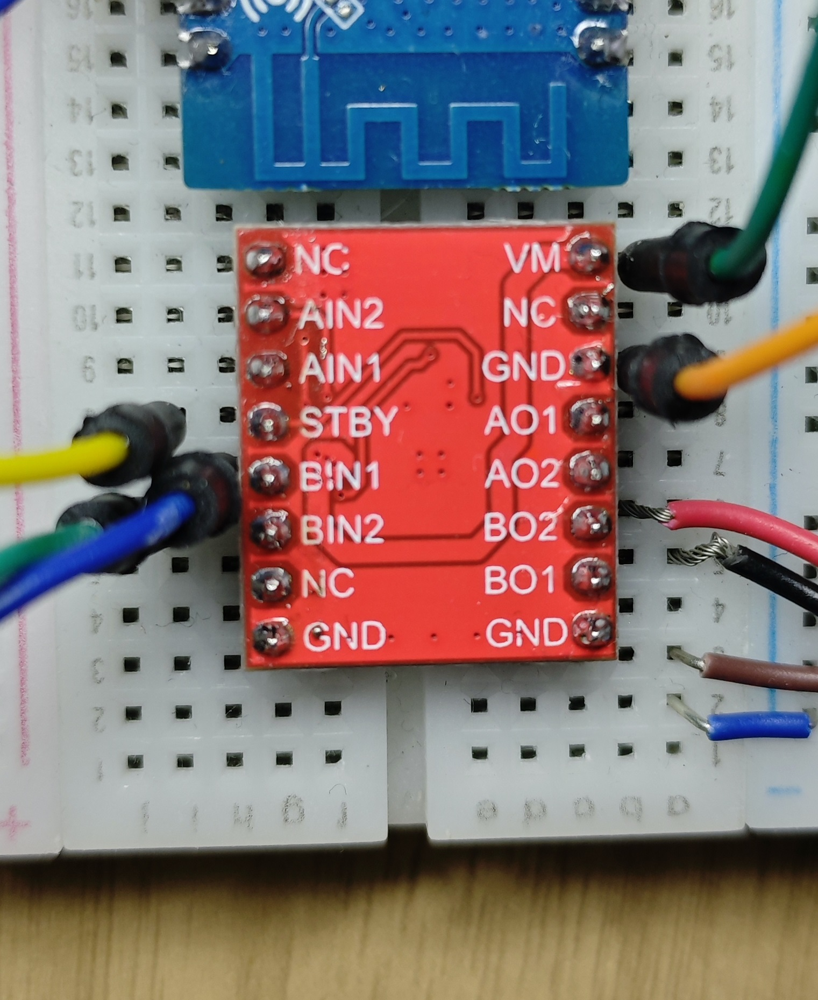

# DRV8833 MicroPython Application
## Introduction
This is a simple application for the DRV8833 module, which may contain some issues as it is my first attempt at writing a class for a module.


# How to Use

Here is a simple example:
```
# Import the library
from drv8833 import DRV8833

# Initialize the class with the pins for [Motor A, Motor B], the STBY pin, and the PWM frequency
# Here, a, b are (4,5) and (2,3) respectively
mt = DRV8833([(4,5),(2,3)], 10, 20_000)

# start(motor_index)
# Start control for both motors
mt.start()

# speed(motor_index, speed)
# The speed range is -100 to 100
mt.speed(0, 50)

# speed_u16(motor_index, speed)
# Control using the original PWM.duty_u16
mt.speed_u16(1, 32767)

# Get the speed value divided into -100~100 range
speed_a = mt.speed()
# Get the speed value divided by pwm's duty_u16
speed_b = mt.speed_u16()

# Display the speeds
print(speed_a)
print(speed_b)

# Reverse Motor A
mt.reverse(0)

# Stop controlling Motor A
mt.stop(0)

# Stop all motors
mt.stop()
```

# Issues Fixed
The STBY issue has been resolved, and the usage of some methods has been simplified, for example, `speed(0,100) = speed_A(100)`

# Outstanding Issues
The code seems to be somewhat redundant and mixed.
